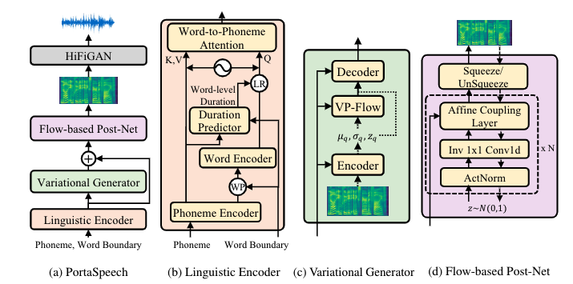

## Abstract

Non-autoregressive text-to-speech (NAR-TTS) models such as FastSpeech 2 and Glow-TTS can synthesize high-quality speech from the given text in parallel. After analyzing two kinds of generative NAR-TTS models (VAE and normalizing flow), we find that: VAE is good at capturing the long-range semantics features (e.g., prosody) even with small model size but suffers from blurry and unnatural results; and normalizing flow is good at reconstructing the frequency bin-wise details but performs poorly when the number of model parameters is limited. Inspired by these observations, to generate diverse speech with natural details and rich prosody using a lightweight architecture, we propose PortaSpeech, a portable and high-quality generative text-to-speech model. Specifically, 1) to model both the prosody and mel-spectrogram details accurately, we adopt a lightweight VAE with an enhanced prior followed by a flow-based post-net with strong conditional inputs as the main architecture. 2) To further compress the model size and memory footprint, we introduce the grouped parameter sharing mechanism to the affine coupling layers in the post-net. 3) To improve the expressiveness of synthesized speech and reduce the dependency on accurate fine-grained alignment between text and speech, we propose a linguistic encoder with mixture alignment combining hard inter-word alignment and soft intra-word alignment, which explicitly extracts word-level semantic information.  Experimental results show that PortaSpeech outperforms other TTS models in both voice quality and prosody modeling in terms of subjective and objective evaluation metrics, and shows only a slight performance degradation when reducing the model parameters to 6.7M (about 4x model size and 3x runtime memory compression ratio compared with FastSpeech 2). Our extensive ablation studies demonstrate that each design in PortaSpeech is effective.

## Audio Samples

1. The essential point to be remembered is that the ornament, whatever it is, whether picture or pattern work, should form part of the page.
    <table style='width: 100%;'>
        <thead>
        <tr>
            <th></th>
            <th>GT</th>
            <th>GT(voc.)</th>
            <th>Tacotron 2</th>
            <th>TransformerTTS</th>
            <th>FastSpeech</th>
        </tr>
        </thead>
        <tbody>
        <tr>
            <th scope="row">wav</th>
            <td><audio controls="" ><source src="resources/audio/GT/0000000001.mp3" type="audio/wav"></audio></td>
            <td><audio controls="" ><source src="resources/audio/GT (voc.)/0000000001.mp3" type="audio/wav"></audio></td>
            <td><audio controls="" ><source src="resources/audio/Tacotron 2/0000000001.mp3" type="audio/wav"></audio></td>
            <td><audio controls="" ><source src="resources/audio/TransformerTTS/0000000001.mp3" type="audio/wav"></audio></td>
            <td><audio controls="" ><source src="resources/audio/FastSpeech/0000000001.mp3" type="audio/wav"></audio></td>
        </tr>
    </tbody>
        <thead>
        <tr>
            <th></th>
            <th>FastSpeech 2</th>
            <th>Glow-TTS</th>
            <th>BVAE-TTS</th>
            <th>PortaSpeech (normal)</th>
            <th>PortaSpeech (small)</th>
        </tr>
        </thead>
        <tbody>
        <tr>
            <th scope="row">wav</th>
            <td><audio controls="" ><source src="resources/audio/FastSpeech 2/0000000001.mp3" type="audio/wav"></audio></td>
            <td><audio controls="" ><source src="resources/audio/Glow-TTS/0000000001.mp3" type="audio/wav"></audio></td>
            <td><audio controls="" ><source src="resources/audio/BVAE-TTS/0000000001.mp3" type="audio/wav"></audio></td>
            <td><audio controls="" ><source src="resources/audio/PortaSpeech (normal)/0000000001.mp3" type="audio/wav"></audio></td>
            <td><audio controls="" ><source src="resources/audio/PortaSpeech (small)/0000000001.mp3" type="audio/wav"></audio></td>
        </tr>
    </tbody>
    </table>

2. Most of caxtons own types are of an earlier character, though they also much resemble flemish or cologne letter.
    <table style='width: 100%;'>
        <thead>
        <tr>
            <th></th>
            <th>GT</th>
            <th>GT(voc.)</th>
            <th>Tacotron 2</th>
            <th>TransformerTTS</th>
            <th>FastSpeech</th>
        </tr>
        </thead>
        <tbody>
        <tr>
            <th scope="row">wav</th>
            <td><audio controls="" ><source src="resources/audio/GT/0000000002.mp3" type="audio/wav"></audio></td>
            <td><audio controls="" ><source src="resources/audio/GT (voc.)/0000000002.mp3" type="audio/wav"></audio></td>
            <td><audio controls="" ><source src="resources/audio/Tacotron 2/0000000002.mp3" type="audio/wav"></audio></td>
            <td><audio controls="" ><source src="resources/audio/TransformerTTS/0000000002.mp3" type="audio/wav"></audio></td>
            <td><audio controls="" ><source src="resources/audio/FastSpeech/0000000002.mp3" type="audio/wav"></audio></td>
        </tr>
    </tbody>
        <thead>
        <tr>
            <th></th>
            <th>FastSpeech 2</th>
            <th>Glow-TTS</th>
            <th>BVAE-TTS</th>
            <th>PortaSpeech (normal)</th>
            <th>PortaSpeech (small)</th>
        </tr>
        </thead>
        <tbody>
        <tr>
            <th scope="row">wav</th>
            <td><audio controls="" ><source src="resources/audio/FastSpeech 2/0000000002.mp3" type="audio/wav"></audio></td>
            <td><audio controls="" ><source src="resources/audio/Glow-TTS/0000000002.mp3" type="audio/wav"></audio></td>
            <td><audio controls="" ><source src="resources/audio/BVAE-TTS/0000000002.mp3" type="audio/wav"></audio></td>
            <td><audio controls="" ><source src="resources/audio/PortaSpeech (normal)/0000000002.mp3" type="audio/wav"></audio></td>
            <td><audio controls="" ><source src="resources/audio/PortaSpeech (small)/0000000002.mp3" type="audio/wav"></audio></td>
        </tr>
    </tbody>
    </table>

3. Full details of the arrangements are to be found in mr. neilds state of prisons in england, scotland, and wales, published in eighteen twelve.
    <table style='width: 100%;'>
        <thead>
        <tr>
            <th></th>
            <th>GT</th>
            <th>GT(voc.)</th>
            <th>Tacotron 2</th>
            <th>TransformerTTS</th>
            <th>FastSpeech</th>
        </tr>
        </thead>
        <tbody>
        <tr>
            <th scope="row">wav</th>
            <td><audio controls="" ><source src="resources/audio/GT/0000000003.mp3" type="audio/wav"></audio></td>
            <td><audio controls="" ><source src="resources/audio/GT (voc.)/0000000003.mp3" type="audio/wav"></audio></td>
            <td><audio controls="" ><source src="resources/audio/Tacotron 2/0000000003.mp3" type="audio/wav"></audio></td>
            <td><audio controls="" ><source src="resources/audio/TransformerTTS/0000000003.mp3" type="audio/wav"></audio></td>
            <td><audio controls="" ><source src="resources/audio/FastSpeech/0000000003.mp3" type="audio/wav"></audio></td>
        </tr>
    </tbody>
        <thead>
        <tr>
            <th></th>
            <th>FastSpeech 2</th>
            <th>Glow-TTS</th>
            <th>BVAE-TTS</th>
            <th>PortaSpeech (normal)</th>
            <th>PortaSpeech (small)</th>
        </tr>
        </thead>
        <tbody>
        <tr>
            <th scope="row">wav</th>
            <td><audio controls="" ><source src="resources/audio/FastSpeech 2/0000000003.mp3" type="audio/wav"></audio></td>
            <td><audio controls="" ><source src="resources/audio/Glow-TTS/0000000003.mp3" type="audio/wav"></audio></td>
            <td><audio controls="" ><source src="resources/audio/BVAE-TTS/0000000003.mp3" type="audio/wav"></audio></td>
            <td><audio controls="" ><source src="resources/audio/PortaSpeech (normal)/0000000003.mp3" type="audio/wav"></audio></td>
            <td><audio controls="" ><source src="resources/audio/PortaSpeech (small)/0000000003.mp3" type="audio/wav"></audio></td>
        </tr>
    </tbody>
    </table>
